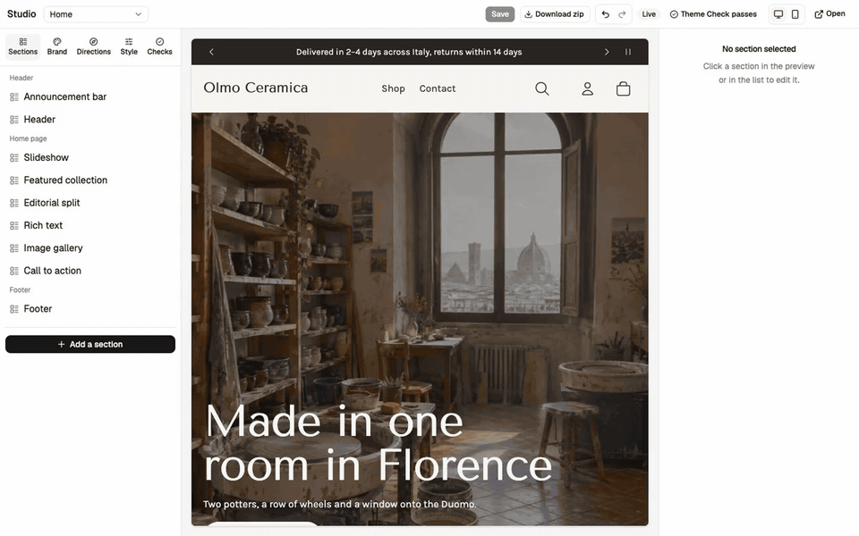
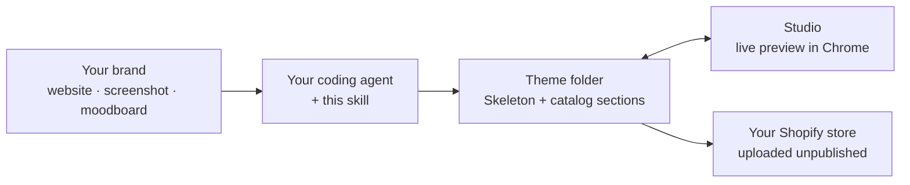
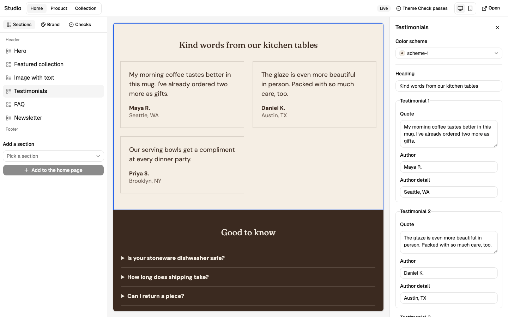
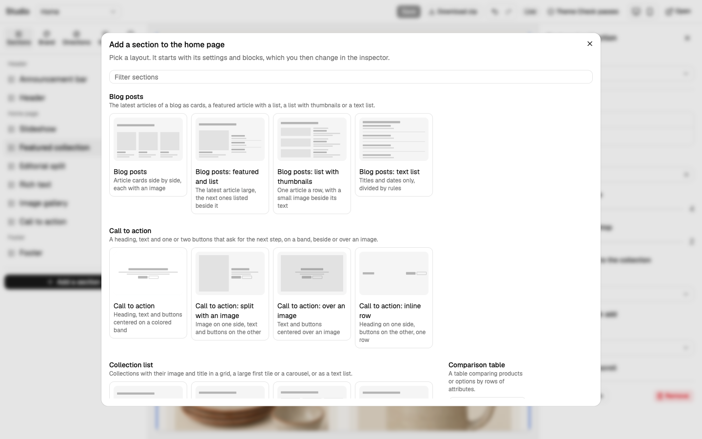
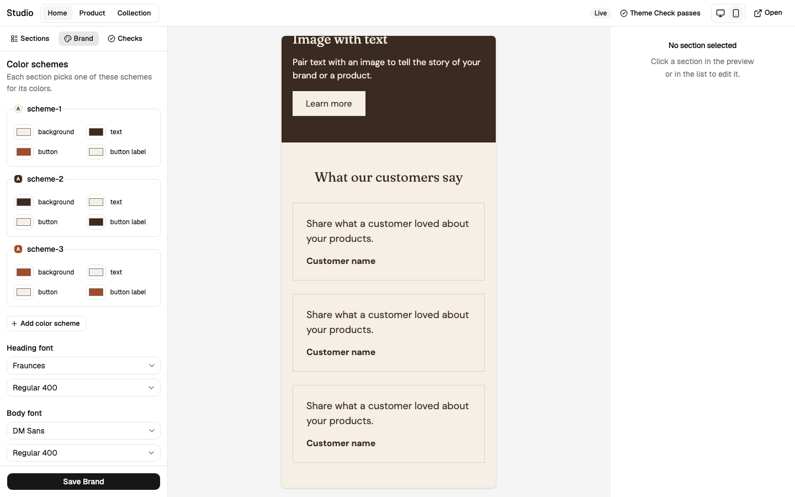

<div align="center">

# Shopify Theme Builder

**Describe your brand. Your coding agent builds the Shopify theme.**

An agent skill for Claude Code, Codex, Cursor and other coding agents: it turns your website, a screenshot or a moodboard into a real Shopify theme, with a local Studio that shows the rendered store while you shape it.

[](https://github.com/itsmylife44/shopify-theme-builder/actions/workflows/ci.yml)
[](#license)
[](https://github.com/vercel-labs/skills)

[Quickstart](#quickstart) · [How it works](#how-it-works) · [The Studio](#the-studio) · [Sections](#the-section-catalog) · [FAQ](#faq)



</div>

## Quickstart

```sh
npx skills add itsmylife44/shopify-theme-builder
```

Then ask your agent:

> *Build me a Shopify theme for my shop. Here's my website: https://…*

That's it. The agent checks what your machine needs, asks only what it can't read from your brand, builds the theme and opens the Studio. You need Node.js 22.12+, Git and the Shopify CLI ([details](#prerequisites)); no store yet? The agent creates a free development store for you.

## Why

A Shopify store that looks like *your* brand usually means one of three things: a paid theme that looks like every other store using it, weeks of learning Liquid, or an agency. AI page builders are faster, but they lock you into an app, a subscription and their own editor.

Shopify Theme Builder takes a different path:

- **Your agent does the work.** No hosted service, no AI inside the Studio, no account to create. Generation runs in the coding agent you already use.
- **Native from the first file.** The theme starts from [Skeleton](https://github.com/Shopify/skeleton-theme), Shopify's own minimal theme. Your colors, fonts and logo live in the theme's settings, so the shop's owner keeps editing everything in Shopify's Theme Editor, with no app installed.
- **You own a plain folder.** The theme is a Git repository with no build step, ready for Shopify's GitHub integration. Change it by hand, with your agent, or in the Studio.
- **Checked on every change.** Shopify's Theme Check runs after each edit; the agent fixes errors before it hands you anything.
- **Nothing goes live by surprise.** Delivery uploads the theme *unpublished*. Publishing stays the owner's decision.

| | Paid theme | Agency or freelancer | AI page-builder app | **Shopify Theme Builder** |
| --- | --- | --- | --- | --- |
| Looks like your brand | Partly | Yes | Partly | **Yes** |
| Time to a first version | Hours | Weeks | Minutes | **Minutes** |
| Edited in Shopify's Theme Editor | Yes | Depends | Often in the app's own editor | **Yes** |
| No app or subscription on the store | Yes | Yes | No | **Yes** |
| You own the code | License | Depends on the contract | No | **Yes** |

## How it works



1. **Brand.** The agent reads your colors, fonts, logo and style from the reference, and asks about the rest: the shop's languages, its name, the theme's author.
2. **Theme.** It creates the theme in a new folder with its own Git history, writes the Brand, composes the home, product and collection pages from the Section Catalog, and writes every heading and paragraph in your shop's default language.
3. **Studio.** It opens the Studio, where you see the real store rendered by Shopify and change colors, text and section order.
4. **Custom sections.** Need something the catalog doesn't have, like a size guide? Ask. The agent writes a section with the same conventions and validates it.
5. **Delivery.** Ask to deliver: the agent checks speed and accessibility with Lighthouse, fixes the accessibility failures, then uploads the theme to your store unpublished, packages it as a zip, or explains the GitHub integration.

## The Studio

The Studio is a local app that opens next to your agent, in Google Chrome. It shows your real theme, rendered by Shopify through `shopify theme dev`, and saves every change straight into the theme's files, where your agent sees it too.



- **Click to edit.** Click a section in the preview, or in the list on the left. On the right, pick its color scheme, rewrite its text (and its blocks' text, like each testimonial), move it or remove it.
- **Add sections** from the Section Catalog, or the Custom Sections your agent wrote.
- **Brand.** Color schemes, fonts from Shopify's font library, and the logo, for the whole theme.
- **Pages.** Home, product and collection, in the top bar.
- **Desktop and mobile** previews, and a Theme Check status that updates after every change.

<p>
  
  
</p>

Images stay in Shopify's Theme Editor, and products, collections and menus in the Shopify admin.

## The Section Catalog

Every section follows the Brand through theme settings, has its own color scheme, and shows Shopify's placeholders on an empty store, so a new development store already looks like a shop.

| Page | Sections |
| --- | --- |
| Home | Hero (image or video) · Slideshow · Featured collection · Featured product · Collection list · Multicolumn · Video · Blog posts · Image gallery · Image with text · Rich text · Testimonials · Logo list · FAQ · Newsletter |
| Product | Main product (media, variants, add to cart, app and Custom Liquid blocks) · Related products |
| Collection | Product grid with filters and sorting |
| Cart | Main cart (discounts, order note, Shop Pay and other accelerated checkout buttons), also shown in the header's cart drawer |
| Search | Search results (products, articles and pages) with filters and sorting |
| Blog | Article cards (image, date, excerpt, author) with tag links and pagination |
| Article | Article (image, date, author, content, tags) with paginated comments and a comment form |
| Any page | Custom Liquid (your own Liquid or HTML, like an app snippet or an embed) |
| Every page | Header (menus, search with suggestions) · Footer (menus, email signup, country and language selectors, payment icons) |

Product cards (featured collection, product grid, search results, related products) have a quick add button: a product without variants goes straight into the cart drawer, one with variants opens a small dialog to pick one.

Every other page (404, password …) uses Skeleton's own layout, styled by the same Brand.

## Prerequisites

- **Node.js 22.12** or newer, and **Git 2.28** or newer.
- **Shopify CLI 4.8.0** or newer: `npm install -g @shopify/cli@latest`. The first time, log in with `shopify auth login` in your own terminal.
- **A store** where you are the owner, or have a staff or collaborator account with theme permissions. No store yet? The agent can create a free development store for you. Give each theme its own store: the Shopify CLI keeps one development theme per store per machine.

The agent checks all of these first, plus the Studio's dependencies, and tells you how to fix what's missing.

## Install and update

```sh
npx skills add itsmylife44/shopify-theme-builder
```

This installs the skill into the current project for the agents the [skills CLI](https://github.com/vercel-labs/skills) detects. Add `-g` to install it for every project.

To update it, run `npx skills update -p` in that project (or `npx skills update -g` for a global install). The update replaces the skill's folder, so the agent reinstalls the Studio's dependencies the next time it runs.

## FAQ

<details>
<summary><b>Do I need to know Liquid or how to code?</b></summary>

No. You talk to your agent and click in the Studio. The theme is still plain Liquid, so a developer can take over any time.
</details>

<details>
<summary><b>Which agents does it work with?</b></summary>

Any agent the [skills CLI](https://github.com/vercel-labs/skills) supports, including Claude Code, Codex and Cursor. The skill is a set of instructions plus a local app; it doesn't depend on one model.
</details>

<details>
<summary><b>What does it cost?</b></summary>

The skill is free and open source. You pay only for the agent you already use; a Shopify development store is free.
</details>

<details>
<summary><b>Will it change my live store?</b></summary>

No. The preview runs on a development theme, and delivery uploads the theme unpublished. Publishing is always your decision, in Shopify admin.
</details>

<details>
<summary><b>Can my shop be in a language other than English, or in several?</b></summary>

Yes. The agent adds the theme's translation files for every language the shop sells in and writes the page text in its default language; Shopify's Translate & Adapt app translates that text into the others.
</details>

<details>
<summary><b>Can a theme I built earlier get the catalog fixes?</b></summary>

Yes. Ask your agent to update your theme's sections: it updates the skill, merges each catalog section's fixes into your theme while keeping your own edits (text, settings, custom CSS), tells you what changed section by section, checks the theme with Theme Check and commits it. Custom sections stay as they are.
</details>

<details>
<summary><b>Does my data go anywhere?</b></summary>

The skill has no server of its own. Your agent talks to its model provider as usual, and the Shopify CLI talks to your store.
</details>

## Contributing

Issues, ideas and new catalog sections are welcome. See [`CONTRIBUTING.md`](CONTRIBUTING.md) for the setup, the checks CI runs, and the conventions every section follows.

If Shopify Theme Builder saved you a week of Liquid, a ⭐ helps other shop owners find it.

## License

| Files | License |
| --- | --- |
| Everything not listed below | MIT, see [`LICENSE`](LICENSE) (the skill folder carries a copy) |
| [`skills/shopify-theme-builder/base-theme/`](skills/shopify-theme-builder/base-theme) | Shopify's Skeleton theme license, see its [`LICENSE.md`](skills/shopify-theme-builder/base-theme/LICENSE.md). It allows use only for themes that work with Shopify. Source and version: [`PROVENANCE.md`](skills/shopify-theme-builder/base-theme/PROVENANCE.md). |
| `.claude/skills/<name>/`, except `theme-tooling` | Third-party development skills, each under its own license file in its folder (all MIT), pinned in [`skills-lock.json`](skills-lock.json) |

A theme you build with this skill contains Base Theme files, so those files stay under Shopify's license: the theme can be used only with Shopify. The catalog sections copied into it remain MIT.

> This project is not affiliated with, endorsed by, or sponsored by Shopify Inc. "Shopify" is a trademark of Shopify Inc., used here only to say what the skill works with.
