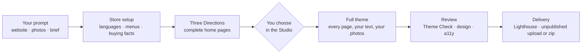

<div align="center">

# Shopify Theme Builder

**Describe your shop in one message. Your coding agent designs, builds, checks and delivers a real Shopify theme.**

An open-source Claude Code plugin and agent skill for Codex, Cursor and other coding agents. It turns your website, a screenshot or a moodboard into three complete theme designs, lets you pick one in a live Studio, writes every page in your shop's language, and hands you a theme that passes Theme Check and an accessibility audit, uploaded unpublished.

[](https://github.com/itsmylife44/shopify-theme-builder/actions/workflows/ci.yml)
[](#license)
[](#quickstart)
[](https://github.com/vercel-labs/skills)
[](https://shopify.dev/docs/storefronts/themes)

[Quickstart](#quickstart) · [Example prompt](#an-example-prompt) · [How it works](#how-it-works) · [Directions](#three-directions-not-one-guess) · [Studio](#the-studio) · [Quality](#quality-checks) · [Sections](#the-section-catalog) · [FAQ](#faq)


</div>

## Quickstart

**1. Install it.**

**Claude Code**: install the plugin from inside a session:

```text
/plugin marketplace add itsmylife44/shopify-theme-builder
/plugin install shopify-theme-builder@shopify-theme-builder
```

**Codex, Cursor, OpenCode and other agents**: install the skill in the folder where you run your agent:

```sh
npx skills add itsmylife44/shopify-theme-builder
```

**2. Send your agent a prompt** like the [example below](#an-example-prompt), or just:

> *Build me a Shopify theme for my shop. Here's my website: https://…*

**3. Answer its questions, then pick a design** in the Studio that opens in Chrome. The agent does the rest and tells you when the theme is ready.

You need Node.js 22.12+, Git and the Shopify CLI ([details](#requirements)). No store yet? The agent creates a free development store for you.

## An example prompt

The more your first message says, the fewer questions the agent asks. Copy this, then change every line to your shop:

```text
Use the shopify-theme-builder skill to build a Shopify theme for my shop.

Shop: Olmo Ceramica, handmade stoneware tableware from a two-person studio in Florence.
Reference: https://olmoceramica.example — take our colors, fonts and logo from there.
Keep: our terracotta #B5552D and our logo. Everything else is open.
Photos: ~/Desktop/olmo-photos (the studio, the kiln, table settings, products on white).
Customers: people setting up a first home who'd rather buy fewer, better things.
It should feel: calm, warm, handmade. Not glossy luxury, not rustic kitsch.
Inspiration outside ceramics: Japanese cookbook layouts, Kinfolk magazine.
Store: we don't have one yet, create a development store in Italy.
Selling: Italy and the rest of the EU, in Italian and English, prices in EUR including VAT.
Buying facts: shipping €6.90, free over €80, 2–4 days in Italy, returns within 14 days.
```

What each line gives the agent:

| Line | What the agent does with it |
| --- | --- |
| **Shop** | The shop's name (also the theme's name) and what it sells, for every heading and paragraph it writes |
| **Reference** | Reads your colors, fonts and logo, and tells you what it took |
| **Keep** | Pins those values: all three designs use them, and vary everything else |
| **Photos** | Uploads them to your shop's Files and places each one where its content fits: the kiln in the process steps, a table scene in the hero |
| **Customers** and **feel** | The brief the three designs are built from; the "not" line rules out the look every shop in your category already has |
| **Inspiration** | References from outside your category, so the design doesn't copy your competitors |
| **Store** | Uses your store, or creates a development store in your country, currency and language |
| **Selling** | Adds the languages, the translation files and the menus, and gives you the admin links for currency, markets and VAT |
| **Buying facts** | Written on the product page, the cart's free-shipping bar and the shipping note; the agent never invents one |

Leave out whatever you don't know yet: the agent asks, one question at a time, and proposes a default you can just confirm. It always reads the brief back to you once before designing anything.

## How it works



| Step | What the agent does | What you do |
| --- | --- | --- |
| **1. Setup** | Checks Node, Git and the Shopify CLI. Connects to your store, or creates a free development store in your shop's country. Asks every store decision in one message: languages, currency and VAT, markets, the main and footer menus, shipping and returns. Writes the menus and enables the languages through the Admin API. | Log in once, confirm the defaults, and follow the admin links for what only you can change. |
| **2. Brief** | Reads your reference for colors, fonts and logo. Asks only what's missing: your brand's world, your shopper, three emotions, references, what the brand rejects, your photos. Reads the brief back. | Answer, then confirm the brief. |
| **3. Directions** | Creates the theme folder from Shopify's [Skeleton](https://github.com/Shopify/skeleton-theme) with its own Git history, uploads your photos, and writes three complete designs, each with its own home page of 6 to 8 sections and your text. | Open the Studio, switch between the three, press **Choose**. |
| **4. Composition** | Carries on by itself as soon as you choose. Builds the product, collection, cart, search, blog, article, contact, 404 and collections pages; writes every text in your shop's language, in the chosen design's voice; places your photos; puts your buying facts on the product page. | Nothing, or watch the preview fill in. |
| **5. Review** | Runs the design checker, screenshots every key page on desktop and phone, runs an accessibility audit with keyboard tests, fixes what it finds, and gives a PASS or HOLD verdict. Commits the theme. | Read the verdict and the hand-off notes. |
| **6. Refine** | Writes Custom Sections for anything the catalog lacks, like a fit finder, with the same conventions and checks. | Edit in the Studio, or ask the agent. |
| **7. Delivery** | Runs Lighthouse on the home, product and collection pages against the Theme Store's bars, fixes the accessibility failures, runs Theme Check, then uploads the theme unpublished, packages a zip, or sets up Shopify's GitHub integration. | Say "deliver it". Publish it yourself when you're ready. |

## Three Directions, not one guess

A single AI-generated design is a coin toss. Shopify Theme Builder writes three **Directions** from your brief, each a whole theme your shop could ship, and lets you compare them live on your own store.

Each Direction decides every design axis, and the three must differ in kind on at least three of them:

| Axis | For example |
| --- | --- |
| **Type** | Fonts from Shopify's library, display size, scale ratio, weight, case, tracking and line height |
| **Color** | A strategy (restrained, committed or full) and the color schemes that carry it, every pair checked for contrast |
| **Shape** | Square, soft or round, for buttons, inputs, cards, media and badges |
| **Spacing** | Compact, normal or airy, and per-section spacing so dense and airy bands alternate |
| **Cards** | Product card anatomy, image ratio, style and hover |
| **Media** | Full-bleed or framed product images |
| **Motion** | None, subtle or expressive, always off under reduced motion |
| **Composition** | Which home sections, in what order, on which color schemes, with one **signature** section |
| **Footer** | One of eight footer layouts, matched to the design |

The agent checks each Direction against a list of generic-design tells before you see it. The chosen one's rules are written to `DIRECTION.md` in your theme, so anyone who edits it later, human or agent, knows why it looks the way it does.

## The Studio

The Studio is a local app that opens next to your agent, in Google Chrome. It shows your real theme rendered by Shopify through `shopify theme dev`, and saves every change straight into the theme's files, where your agent sees it too.


- **Click to edit.** Click a section in the preview or in the list, header and footer included. Change its color scheme, text, layout, collections, products, menus and links. Every edit applies live.
- **Add sections** from the catalog, picking a layout from wireframe thumbnails, or add the Custom Sections your agent wrote.
- **Directions, Brand and Style.** Switch between the three Directions and choose one; edit color schemes, fonts and logo; tune the type scale, shape, buttons, spacing, cards, media and motion.
- **Every page.** Home, product, collection, page, contact, cart, search, blog, article, 404 and the collections list, on desktop and mobile.
- **Safe to experiment.** Undo and redo, a Save button that commits a checkpoint to the theme's Git history, and a live Theme Check status.
- **Download zip** gives the theme as the file Shopify's admin takes.

<p>
  
  
</p>

Videos and images beyond your brief's photos are picked in Shopify's Theme Editor (the Studio links to the right section), and products, collections and menus stay in the Shopify admin.

## Quality checks

Nothing reaches you unchecked, and nothing goes live without you.

| Check | When it runs | The bar |
| --- | --- | --- |
| **Theme Check** (Shopify's linter) | After every change | Zero errors before anything is handed over |
| **Contrast** | Every color scheme | Text 4.5:1, borders and buttons 3:1 |
| **Design checker** | Each Direction, and the review | No placeholders, no leftover example text, a real type hierarchy, one h1 per page, products near the top of the home |
| **Accessibility** (axe-core, WCAG 2.2 A and AA) | The review and delivery | Zero findings on home, product and collection, desktop and phone, plus a keyboard pass through the menu, cart drawer and quick add |
| **Lighthouse** | Delivery | The Theme Store's bars: performance 60, accessibility 90 |
| **Publishing** | Never | The theme is uploaded unpublished; publishing is the Merchant's decision |

## The Section Catalog

Over 40 sections, each styled by the Brand through theme settings, with its own color scheme, named layouts, right-to-left support, and Shopify's placeholders on an empty store, so a new development store already looks like a shop.

| Where | Sections |
| --- | --- |
| **Home and pages** | Hero (image or video) · Slideshow · Type banner · Featured collection · Featured product · Collection list · Multicolumn · Image with text · Editorial split · Lookbook (shoppable hotspots) · Image gallery · Video · Rich text · Call to action · Testimonials · Press quotes · Logo list · Marquee · Spec tiles · Process steps · Timeline · Team · Comparison table · FAQ · Newsletter · Blog posts · Custom Liquid |
| **Product** | Media in a grid, stacked, with thumbnails or in a carousel · full-screen zoom with pinch on touch · variant picker naming the selected value · sticky add-to-cart bar on phones · size guide dialog · shipping note and collapsible details · app and Custom Liquid blocks · Related products |
| **Collection and search** | Product grid with filters and sorting that update without reloading, and a filter drawer on phones |
| **Cart** | Cart page and drawer: discounts, order note, free-shipping progress, Shop Pay and other accelerated checkouts, product suggestions when empty |
| **Blog, article, contact, 404, collections list** | Each with its catalog main section, like a contact form beside the shop's details or a 404 with search |
| **Every page** | Announcement bar · Header (three layouts, optionally sticky, with predictive search) · Footer (eight layouts, menus, newsletter, country and language selectors, payment icons) |

Product cards have a quick add button: a product without variants goes straight to the cart drawer, one with variants opens a small picker.

## What you end up with

A plain theme folder you own, with no build step and no app on the store:

```text
olmo-ceramica-theme/
├── DIRECTION.md     your brief, the three Directions and the chosen one's rules
├── config/          the Brand and each Direction as theme settings presets
├── sections/        only the catalog sections the theme uses, plus your Custom Sections
├── templates/       every page, composed and written in your shop's language
├── listings/        each Direction's home page
├── locales/         the theme's text in every language the shop sells in
└── .git/            its own history, ready for Shopify's GitHub integration
```

The shop's owner keeps editing it in Shopify's Theme Editor like any theme. A developer can take over the Liquid any time.

## Why

A store that looks like *your* brand usually means one of three things: a paid theme that looks like every other store using it, weeks of learning Liquid, or an agency. AI page builders are faster, but they lock you into an app, a subscription and their own editor.

| | Paid theme | Agency or freelancer | AI page-builder app | **Shopify Theme Builder** |
| --- | --- | --- | --- | --- |
| Looks like your brand | Partly | Yes | Partly | **Yes** |
| Time to a first version | Hours | Weeks | Minutes | **One agent session** |
| Designs to compare | One, plus its presets | Depends on the budget | One | **Three, live on your store** |
| Edited in Shopify's Theme Editor | Yes | Depends | Often in the app's own editor | **Yes** |
| No app or subscription on the store | Yes | Yes | No | **Yes** |
| You own the code | License | Depends on the contract | No | **Yes** |

- **Your agent does the work.** No hosted service, no AI inside the Studio, no account to create. Generation runs in the coding agent you already use.
- **Native from the first file.** Built on Skeleton, Shopify's own minimal theme. Colors, fonts and logo live in theme settings.
- **Nothing goes live by surprise.** The skill never publishes a theme.

## Requirements

- **Node.js 22.12** or newer, and **Git 2.28** or newer.
- **Shopify CLI 4.8.0** or newer: `npm install -g @shopify/cli@latest`. The first time, log in with `shopify auth login` in your own terminal.
- **Google Chrome**, for the Studio, the screenshots, the accessibility check and Lighthouse.
- **A store** where you are the owner, or have a staff or collaborator account with theme permissions. No store yet? The agent creates a free development store. Give each theme its own store: the Shopify CLI keeps one development theme per store per machine.

The agent checks all of these first, plus the Studio's dependencies, and tells you how to fix what's missing.

## Install and update

### Claude Code plugin

```text
/plugin marketplace add itsmylife44/shopify-theme-builder
/plugin install shopify-theme-builder@shopify-theme-builder
```

The plugin is available in every project. Update it with `claude plugin update shopify-theme-builder@shopify-theme-builder`, then start a new session.

### Any agent, with the skills CLI

```sh
npx skills add itsmylife44/shopify-theme-builder
```

This installs the skill into the current project for the agents the [skills CLI](https://github.com/vercel-labs/skills) detects. Add `-g` to install it for every project.

To update it, run `npx skills update -p` in that project (or `npx skills update -g` for a global install). The update replaces the skill's folder, so the agent reinstalls the Studio's dependencies the next time it runs.

## FAQ

<details>
<summary><b>Do I need to know Liquid or how to code?</b></summary>

No. You talk to your agent and click in the Studio. The theme is still plain Liquid, so a developer can take over any time.
</details>

<details>
<summary><b>Which agents does it work with?</b></summary>

Any agent the [skills CLI](https://github.com/vercel-labs/skills) supports, including Claude Code, Codex and Cursor. The skill is a set of instructions plus a local app; it doesn't depend on one model.
</details>

<details>
<summary><b>What does it cost?</b></summary>

The skill is free and open source. You pay only for the agent you already use; a Shopify development store is free.
</details>

<details>
<summary><b>Will it change my live store?</b></summary>

No. The preview runs on a development theme, and delivery uploads the theme unpublished. Publishing is always your decision, in Shopify admin.
</details>

<details>
<summary><b>I'm building for a client. How does the hand-over work?</b></summary>

Build on a development store, then deliver to the client's store with a collaborator account (the agent uploads it unpublished there), or send them the zip from the Studio's Download zip button. A development store itself can't be transferred.
</details>

<details>
<summary><b>Can my shop be in a language other than English, or in several?</b></summary>

Yes. The agent writes the page text in the shop's default language, adds the theme's translation files for every language it sells in, and enables those languages on the store. Shopify's free Translate & Adapt app then translates the page text into the others. Layouts mirror for right-to-left languages.
</details>

<details>
<summary><b>What if I don't have photos yet?</b></summary>

Say "none yet". The Directions then stand on type and color, with sections that need no image, and product cards from your store. Add photos later and ask the agent to place them.
</details>

<details>
<summary><b>Can a theme I built earlier get the catalog fixes?</b></summary>

Yes. Ask your agent to update your theme's sections: it updates the skill, merges each catalog section's fixes into your theme while keeping your own edits (text, settings, custom CSS), tells you what changed section by section, checks the theme with Theme Check and commits it. Custom sections stay as they are.
</details>

<details>
<summary><b>Does my data go anywhere?</b></summary>

The skill has no server of its own. Your agent talks to its model provider as usual, and the Shopify CLI talks to your store.
</details>

## Contributing

Issues, ideas and new catalog sections are welcome. See [`CONTRIBUTING.md`](CONTRIBUTING.md) for the setup, the checks CI runs, and the conventions every section follows.

If Shopify Theme Builder saved you a week of Liquid, a ⭐ helps other shop owners find it.

## License

| Files | License |
| --- | --- |
| Everything not listed below | MIT, see [`LICENSE`](LICENSE) (the skill folder carries a copy) |
| [`skills/shopify-theme-builder/base-theme/`](skills/shopify-theme-builder/base-theme) | Shopify's Skeleton theme license, see its [`LICENSE.md`](skills/shopify-theme-builder/base-theme/LICENSE.md). It allows use only for themes that work with Shopify. Source and version: [`PROVENANCE.md`](skills/shopify-theme-builder/base-theme/PROVENANCE.md). |
| `.claude/skills/<name>/`, except `theme-tooling` | Third-party development skills, each under its own license file in its folder (all MIT), pinned in [`skills-lock.json`](skills-lock.json) |

A theme you build with this skill contains Base Theme files, so those files stay under Shopify's license: the theme can be used only with Shopify. The catalog sections copied into it remain MIT.

> This project is not affiliated with, endorsed by, or sponsored by Shopify Inc. "Shopify" is a trademark of Shopify Inc., used here only to say what the skill works with.
